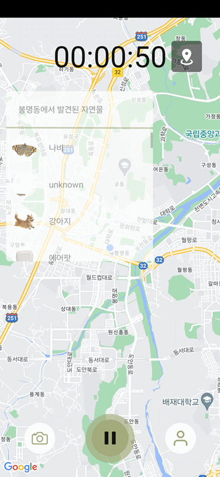
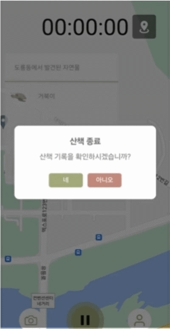
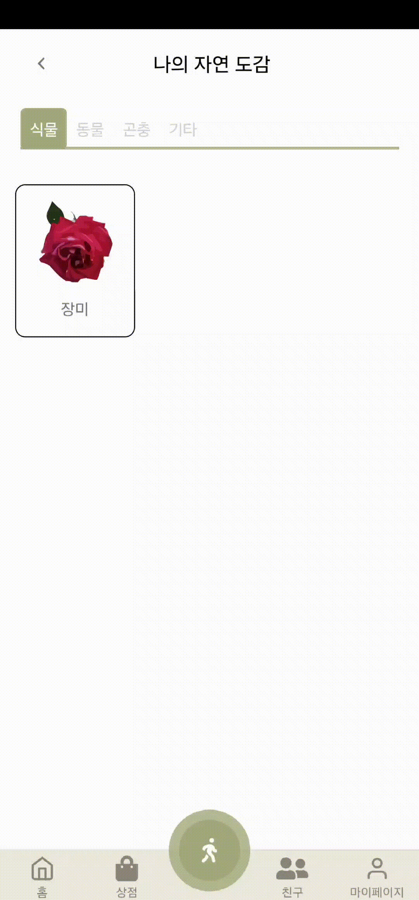
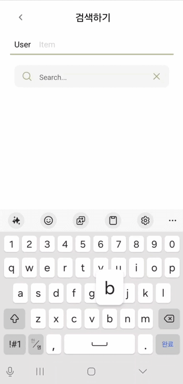
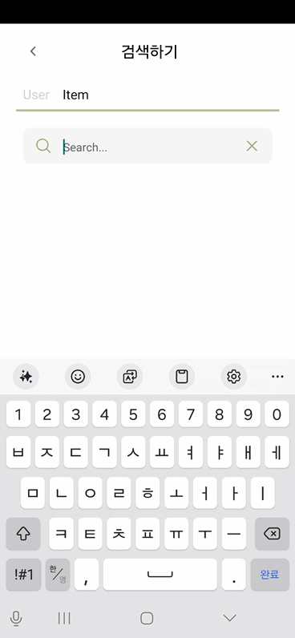
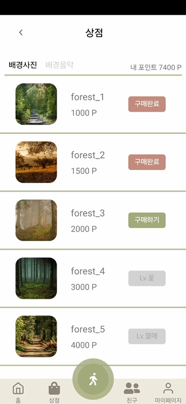
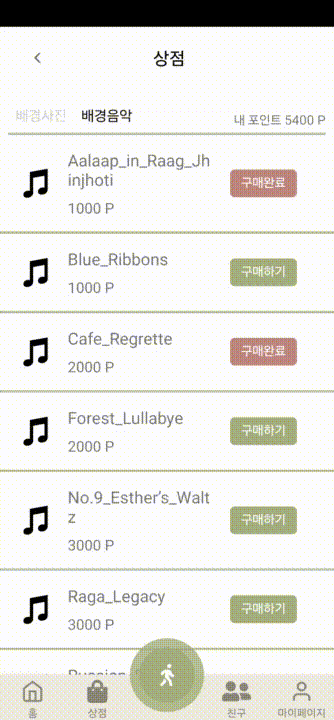
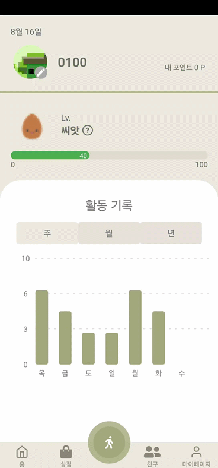
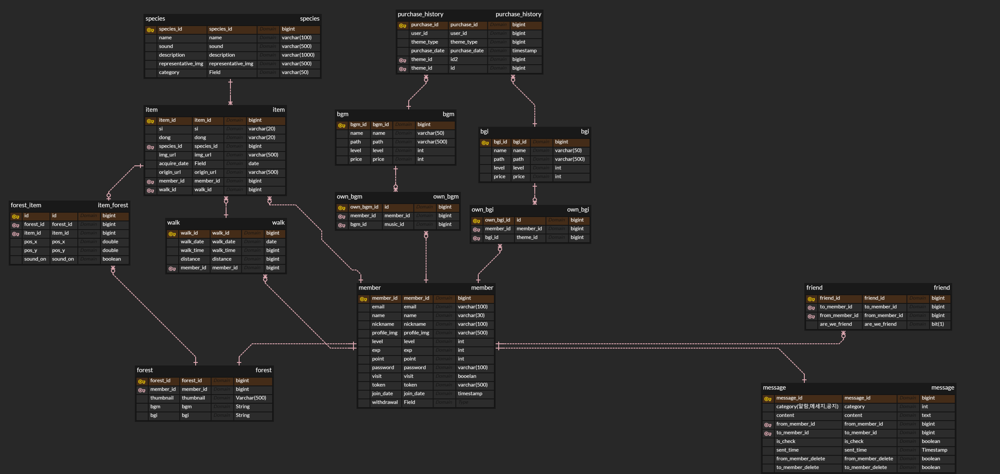
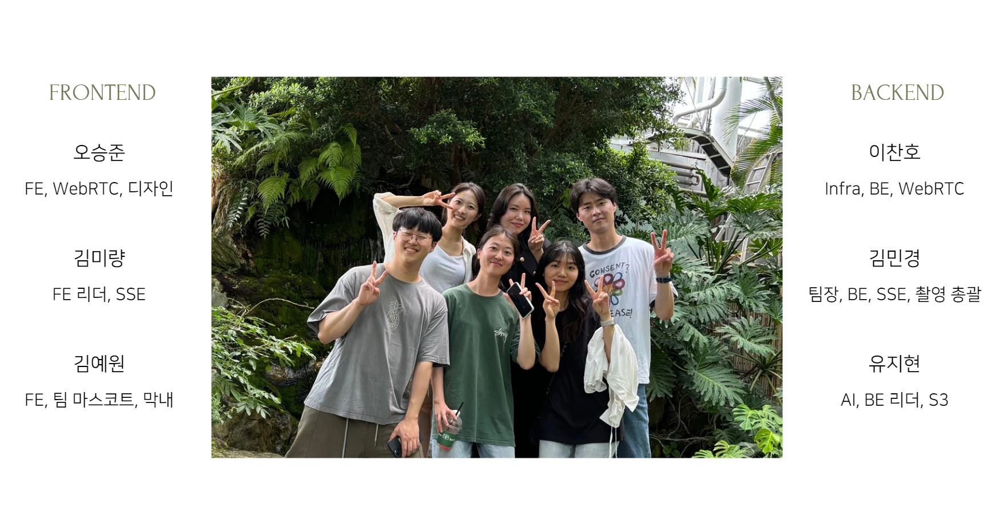

# SUPIA


## Ⅰ. 프로젝트 소개

### **📌 기획 의도**

```bash
OECD 평균 근로 시간보다 약 200시간 많이 근무하는 현대의 한국인들은 바쁜 일상에 지쳐 살아갑니다.

숲이야는 지친 현대인들에게 자연과 함께하는 시간을 만들어 일상의 무거움을 덜어주고자 합니다.

주변의 자연을 걸으며 친구와 함께 순간을 즐기고, 기록하며 나만의 숲을 만들어 보세요.

```

### **📌 프로젝트 설명**

- 내 주변의 자연물을 찾아 걸으며 일상 밖에서의 휴식을 취할 수 있게 합니다

- 산책을 통해 바쁜 일상에 지친 몸과 마음을 튼튼하게 합니다.

- 길거리의 자연물을 아이템으로 만들어가며 나만의 숲을 꾸밀 수 있습니다.

- 도감에 기록된 아이템을 돌아보며 나의 산책 기록을 추억할 수 있습니다.

## Ⅱ. 기능 소개

### 01. 회원가입/ 로그인 🧑👩


#### 회원 가입

- 이메일, 이름, 닉네임, 비밀번호를 활용하여 회원 가입

- 이메일 입력 시 이메일 형식이 아닌 경우 회원가입 및 로그인이 불가능합니다.

#### 로그인

- 이메일과 비밀번호로 로그인

<br>

### 02. 산책 🚶‍♂️🚶‍♀️




#### 산책 기능

- 현재 위치 및 산책 시간을 확인할 수 있으며, 산책하는 지역에서 발생된 아이템들의 종류를 확인할 수 있습니다.

- 산책 종료 시 산책 경로 및 산책 시간이 표시되며 산책 중에 얻은 아이템과 포인트, 경험치를 확인할 수 있습니다.


#### 카메라 기능

- 카메라를 활용하여 자연물을 촬영하고 아이템으로 저장합니다.

- 촬영된 사진은 Classification → Segmentation → Color Quantization 의 순서대로 이루어져 단순화된 2D 이미지로 도감에 저장합니다.

- 클래스에 등록되지 않은 아이템이 등록될 경우 직접 이름을 등록할 수 있습니다.

#### 통화 기능

- 친구 리스트의 친구와 WebRTC를 활용한 영상 통화 기능입니다.

- 영상 통화 중에 친구의 화면을 통해서 촬영이 가능하며, 이를 활용하여 다른 지역의 친구에게서 부터 아이탬을 촬영할 수 있습니다.

<br>

### 03. 아이템 도감 📔



#### 도감 아이템 확인

- 산책 동안 촬영한 아이템을 확인할 수 있습니다.

- 각 종 별 대표 사진을 확인할 수 있으며, 개별 사진 클릭 시 촬영 시각과 이름을 확인할 수 있습니다.

#### 선물 기능

- 친구에게 자신의 아이템을 선물할 수 있습니다.

- 선물한 아이템은 자신의 도감에서 사라지게 됩니다.

<br>

### 04. 검색 🔍




#### 사용자 검색

- 닉네임, 이름을 활용하여 사용자를 검색합니다.

- 검색된 사용자를 클릭하면 사용자의 숲 썸네일과 정보를 확인할 수 있으며, 친구 추가 요청을 보낼 수 있습니다.

#### 아이템 검색

- 아이템의 종을 검색해서 주변의 아이템을 검색할 수 있습니다.

<br>

### 05. 나의 숲 🌳


#### 숲 꾸미기

- 사용자 도감의 아이템을 통해 숲을 꾸밀 수 있습니다.

- 아이템을 위치 시킨 후 숲 페이지를 나가면 편집된 이미지를 숲 썸네일로 저장할 수 있습니다.

#### 아이템 관리

- 배치된 아이템은 내장된 소리를 끄거나 킬 수 있습니다.

- 배치된 아이템은 다시 클릭하여 제거할 수 있습니다.

<br>

### 06. 친구 👫


#### 메세지

- 친구로 등록된 사용자에게 메세지를 보낼 수 있습니다.

- 보내진 메세지는 메세지함에 저장되며 상대방이 확인하거나 답장을 보낼 수 있습니다.

<br>

### 07. 상점 🏤




- 산책을 통해 얻은 포인트로 나의 숲에 사용할 배경 사진이나 배경 음악을 구매할 수 있습니다.

- 사용자의 레벨에 따라 구매할 수 있는 배경과 배경 음악의 폭이 넓어집니다.

### 08. 마이페이지 👩‍💻



#### 걷기 기록 확인

- 마이페이지에서 지금까지 산책했던 거리에 대한 정보를 볼 수 있습니다.

#### 개인 정보 수정

- 정보 수정 페이지에서는 프로필 사진, 이름, 닉네임, 비밀번호 등의 개인 정보를 수정할 수 있습니다.

- 로그아웃 및 회원 탈퇴를 진행할 수 있습니다.

## Ⅲ. 기술 스택

### Back-End

- JDK 17
- Springboot
- Spring Data JPA
- Spring Security
- MySQL
- SSE
- AWS S3

### Front-End

- VSCode
- React-Native
- OpenVidu
- Node.Js

### Infra

- AWS EC2
- Docker
- Jenkins

### AI

- FastAPI
- Ultralytics

### Tools

- GitLab
- Notion
- Jira
- Figma
- MatterMost

## Ⅳ. 산출물

### 📃 ERD



### ⚙ 아키텍쳐(임시)


## V. 팀원 소개 및 회고



### 김민경

### 유지현

### 이찬호

### 김미량

### 김예원

### 오승준
